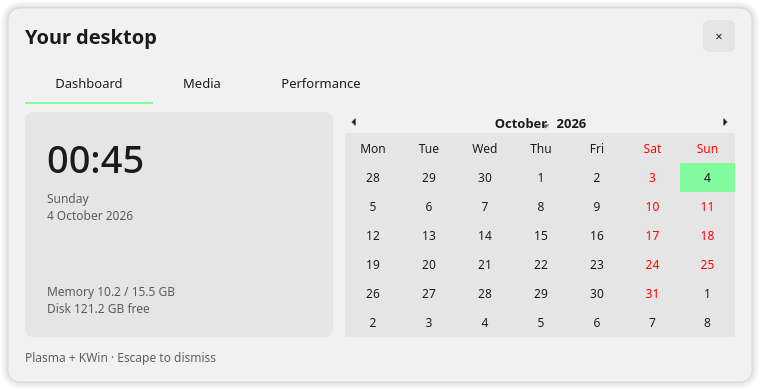
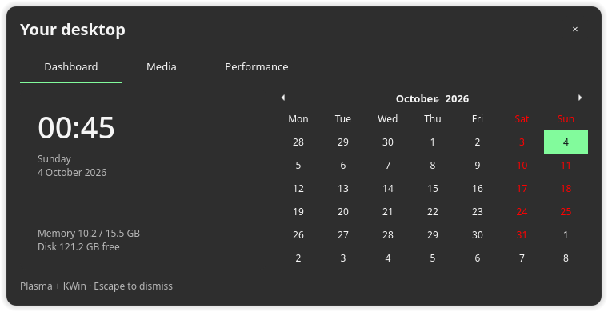

# KamaKiriStudio 0.4.0

A native KDE desktop studio that keeps Plasma and KWin as its base. Inspired by Caelestia and Ryoku, with 22 official Omarchy color palettes, including Osaka Jade.

## Features

- Complete KDE color palettes, editable accents and panel placement, height and floating controls.
- A local wallpaper picker with optional matching background, text, selection and accent colors.
- An installed KDE widget collection: clock, media player, CPU, memory, application dashboard, calendar, volume and network. Existing widgets are preserved and duplicate types are skipped.
- A dashboard with live clock, memory and disk information, MPRIS media controls, KRunner launcher and KDE settings shortcuts.
- Data-only profile import and export. Import previews choices before applying them; desktop and panel targets stay local to this machine.
- A picker for installed desktop/window-manager sessions, handing off to KDE’s logout confirmation and the login-screen session menu.
- About, manual GitHub release checks and an optional five-minute update monitor while the app is open. No automatic downloads or installations.

The launcher and dashboard now open as separate rounded, frameless popups, with optional compositor blur. **Reference rounded** uses larger corners inspired by the supplied desktop images. **Fluent inspired** uses tighter corners, neutral surfaces and lighter borders. Choose **Follow desktop**, **Light** or **Dark**. These are original Qt/KDE interfaces; they do not use Microsoft components or replace Plasma with Quickshell. Blur depends on the existing KWin blur effect; it is requested, never forced on. Popups close with Escape, their close button or focus moving to another application. KWin controls placement on Wayland.

In **Appearance**, use **Popup look** and **Preview launcher/dashboard**. The **Slim left rail** panel preset selects a 40px floating panel and adds two native launch buttons. A **Floating bottom bar** preset is also available. These presets and popup-look changes turn off **Include KDE color changes** so your palette stays unchanged; you can enable it explicitly. Apply & try uses the existing Yes/No recovery flow for panel geometry, popup preferences and newly added panel buttons. Existing widgets are preserved. The panel itself uses your installed Plasma theme’s rounded floating shape.

The app launcher filters installed application metadata and opens the selected app through KDE’s ApplicationLauncherJob. Search input is never treated as a shell command. The popup dashboard has calendar, media and CPU/memory/disk/network pages. GPU, weather and audio visualizers are not included. The manager also previews a Fluent-inspired appearance when that popup style is selected.

## Get started

Source checkouts must be built first. Release bundles include a locally built x86-64 binary; it is linked against Qt/KDE system libraries, not a universal AppImage. Other distributions should build against their own installed packages.

```sh
cmake -S . -B build -DCMAKE_BUILD_TYPE=Release
cmake --build build -j2
mkdir -p bin
cp build/kamakiri-studio bin/kamakiri-studio
python3 install-local.py
```

Open **KamaKiriStudio** from the Applications menu, or run `./launch.sh`. Use `./launch.sh --demo` for a preview that leaves appearance unchanged.

Requires C++17, CMake, Qt6 Widgets/DBus/Network/Test, KDE Frameworks 6 Config, IdleTime, Service, KIO and WindowSystem, libwayland-client development files, pkg-config and wayland-scanner. Runtime appearance changes require Plasma 6, `plasma-apply-colorscheme` and installed Breeze schemes. Installation does not install dependencies or request root.

## Try changes and recover

Choose a palette in Appearance. Choose a local PNG, JPEG, WebP or BMP in **Wallpaper and widgets**, optionally enable matching colors, select a desktop target and select widgets. **Apply & try** applies the choices from both pages together.

The confirmation has **Yes** and **No**, with no visible countdown. If there is no input for the first 15 seconds after changes finish applying, they revert. The click that started Apply is excluded. The first subsequent keyboard, pointer or touch input permanently removes the timeout for that trial. Yes keeps the changes; No or closing the confirmation restores them. You can test other windows with the confirmation open.

An independent worker snapshots the settings before mutation. If the manager closes or its heartbeat stops for four seconds, the trial reverts. If the worker also crashes or the machine restarts, startup/login recovery restores abandoned trials. Recovery failures preserve snapshots and are reported; restoration cannot be guaranteed when Plasma or the original desktop/panel is unavailable.

Wallpaper trials currently support KDE’s **Image** wallpaper type and change only its image setting. Widgets added by the trial are marked with its transaction ID; rollback removes those widgets, leaving existing widgets alone. Kept widgets can be moved/resized using Plasma’s Edit Mode. Icons, authentication, login screen, lock screen, services and compositor remain unchanged.

Wayland activity monitoring requires version 2 of `ext_idle_notifier_v1`, using inhibitor-independent input notifications. It does not capture keys, text or pointer coordinates. Unsupported sessions refuse appearance changes. X11 uses KIdleTime but has not been live-tested here.

## Desktop sessions

The session page discovers installed Wayland/X11 session definitions without executing their commands or installing window managers. **Log out to switch…** opens KDE’s logout confirmation. Choose the target session at the login screen. It does not automatically select another session or change the display manager. Another Wayland compositor runs as a separate session; it cannot replace KWin within a running Plasma Wayland session.

## Updates and privacy

**About and updates** checks public stable releases at `https://api.github.com/repos/TridentSpoon/KamaKiriStudio/releases/latest`. Monitoring is opt-in, runs only while the app is open, and sends an application User-Agent over HTTPS. No desktop settings, personal files or account tokens are sent. Updates are reviewed/downloaded manually from the official repository. Local build checks compare a bundled binary with its local SHA-256 manifest; this is a consistency check, not a signature or trust guarantee. A local check may be unavailable if the original build directory no longer exists.

Private trial records live in `${XDG_STATE_HOME:-~/.local/state}/kamakiri-studio`. Kept color schemes remain installed; reverted schemes are removed. Profiles contain local image paths when a wallpaper is selected; images are not embedded, so imported profiles need accessible local files.

The app does not run the reviewed Caelestia KDE installer, plugin store or remote configuration scripts. Only attributed Omarchy palette data is embedded. No password handling or privileged helper is used.

## Tests

```sh
ctest --test-dir build --output-on-failure
python3 tests/worker_integration.py build/kamakiri-studio
```

Tests cover trial decisions, hostile data, palette serialization, local image validation, widget ownership and simulated worker lifecycle. Live Plasma testing verified a wallpaper/widget trial and exact restoration of the original wallpaper, widget list and parsed color settings. See [VALIDATION.md](VALIDATION.md) for limits.

## Remove

Finish/revert any trial first. The installer owns these files:

- `~/.local/bin/kamakiri-studio`
- `~/.local/share/applications/kamakiri-studio.desktop`
- `~/.local/share/applications/kamakiri-launcher.desktop`
- `~/.local/share/applications/kamakiri-dashboard.desktop`
- `~/.config/autostart/kamakiri-studio-recovery.desktop`
- `~/.local/share/kamakiri-studio/installation.json`

Remove them to uninstall. Keep recovery records and kept schemes until you no longer need them. About/update preferences use the normal Qt application settings file.

## License

Original application code is MIT. Omarchy palette attribution and permission are in [OMARCHY-PALETTES.md](OMARCHY-PALETTES.md) and [OMARCHY-LICENSE](OMARCHY-LICENSE). The vendored Wayland protocol retains its upstream MIT notice. Breeze scheme notices are preserved at runtime. Qt/KDE/Wayland libraries come from installed system packages. This project is independent of KDE, Caelestia, Ryoku and Omarchy.

## Popup previews

| Fluent Light | Fluent Dark |
| --- | --- |
|  |  |

[Reference rounded launcher](docs/rounded-launcher.png). Screenshots show the app’s preview mode; launching applications is disabled in that mode.
